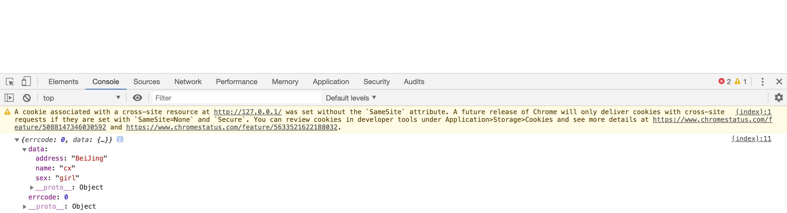

&ensp;&ensp;&ensp;&ensp;&ensp;&ensp;&ensp;说到跨域我们不得不先来说说为什么会产生跨域。其实跨域就是指浏览器不能执行其它网站的脚本，它是由浏览器的同源策略造成的，是浏览器对javascript施加的安全限制。
&ensp;&ensp;&ensp;&ensp;&ensp;&ensp;&ensp;那什么又是同源策略呢？同源策略是一种约定，它是浏览器最核心也最基本的安全功能，所谓的同源是指域名、协议、端口相同。
&ensp;&ensp;&ensp;&ensp;&ensp;&ensp;&ensp;下面就让我来介绍几种解决跨域的方法吧！
### 1、JSONP
- 原理：就是利用```<script> ```标签没有跨域限制的漏洞。通过```<script>```标签指向一个需要访问的地址并提供一个回调函数来接收数据当需要通讯时。
客户端
```xml
<script>
    function jsonp(data) {
        console.log(data)
    }
</script>
<script type="text/javascript" src="http://127.0.0.1:8888/get/jsonp?callback=jsonp"></script>
```
服务端
```js
router.get('/get/jsonp', (ctx, next) => {
    let callbackName = ctx.callback || 'callback'
    let data = {
        "errcode": 0,
        "data": {
            "name": "cx",
            "sex": "girl",
            "address": "BeiJing"
        }
    let jsonpStr = `~${callbackName}(${JSON.stringify(data)})`
    ctx.type = 'text/javascript'
    ctx.body = jsonpStr
    }
})
```
页面显示

- 优点
    - JSONP 使用简单且兼容性不错
- 缺点
    - 只限于 get 请求（即只读）
    - 它只支持跨域HTTP这种情况
    - jsonp在调用失败的时候，不会返回各种HTTP状态码（jsonp的错误处理机制并不完善，我们没办法进行错误处理）
    - 需要客户端和服务端定制进行开发，服务端返回的数据不是标准的json数据，而是callback包裹的数据
    - JSONP只会发一次请求

&ensp;&ensp;&ensp;&ensp;&ensp;&ensp;&ensp;在我们开发中可能会遇到多个JSONP请求的回调函数名是相同的，这时候就需要自己封装一个JSONP，下面是实现的代码
```js
function jsonp(url, jsonpCallback, success) {
    let script = document.createElement('script')
    script.src = url
    script.async = true
    script.type = 'text/javascript'
    window[jsonpCallback] = function(data) {
        success && success(data)
    }
    document.body.appendChild(script)
}
jsonp('http://127.0.0.1:8888/get/jsonp', 'callback', function(value) {
    console.log(value)
})
```

### 2、CORS
- 原理：服务端设置 Access-Control-Allow-Origin 就可以开启 CORS。 该属性表示哪些域名可以访问资源，如果设置通配符则表示所有网站都可以访问资源。

&ensp;&ensp;&ensp;&ensp;&ensp;&ensp;&ensp;虽然设置 CORS和前端没什么关系，但是通过这种方式解决跨域问题的话，会在发送请求时出现两种情况，分别为简单请求和复杂请求
#### 简单请求
1、使用下列方法之一：
- GET
- HEAD
- POST

2、HTTP头信息不超出以下几种字段：
- Accept
- Accept-Language
- Content-Language
- Last-Event-ID
- Content-Type：只限于三个值application/x-www-form-urlencoded、multipart/form-data、text/plain

#### 复杂请求
&ensp;&ensp;&ensp;&ensp;&ensp;&ensp;&ensp;不满足简单请求的就是复杂请求，对于复杂请求来说，首先会发起一个预检请求，该请求是 option 方法，通过该请求来知道服务端是否允许跨域请求。当使用XMLHttpRequest发送请求时，浏览器发现该请求不符合同源策略，会给该请求加一个请求头：Origin，后台进行一系列处理，如果确定接受请求则在返回结果中加入一个响应头：Access-Control-Allow-Origin;浏览器判断该相应头中是否包含Origin的值，如果有则浏览器会处理响应，我们就可以拿到响应数据，如果不包含浏览器直接驳回，这时我们无法拿到响应数据

### 3、document.domain