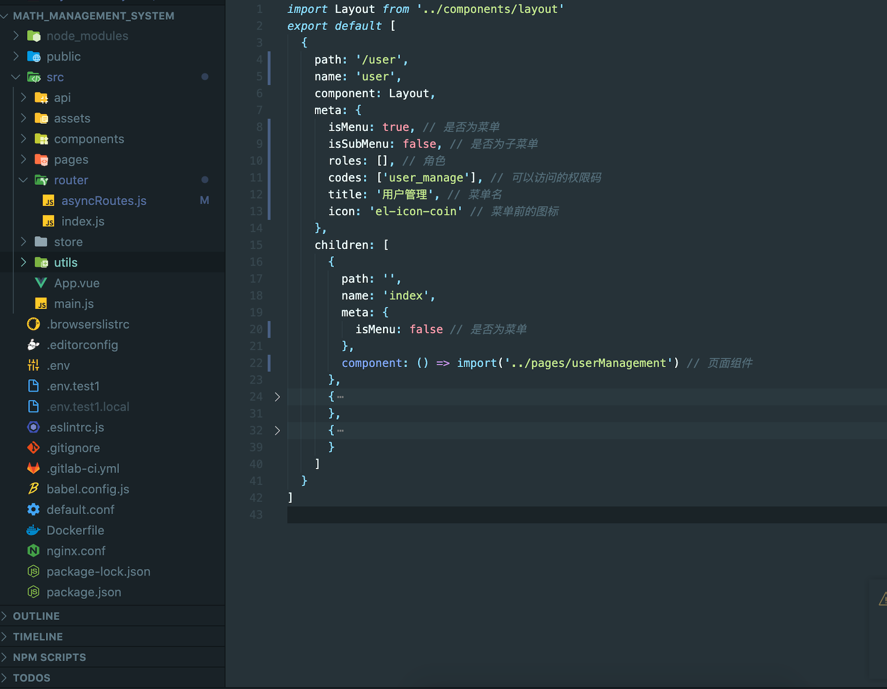
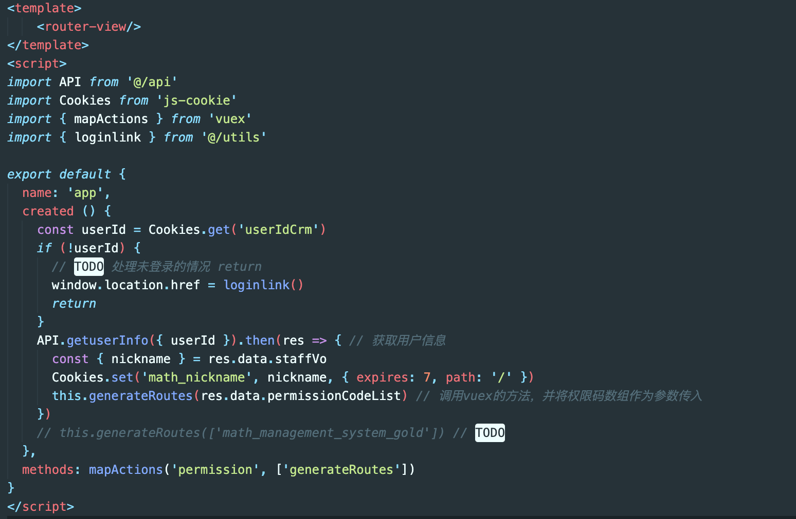
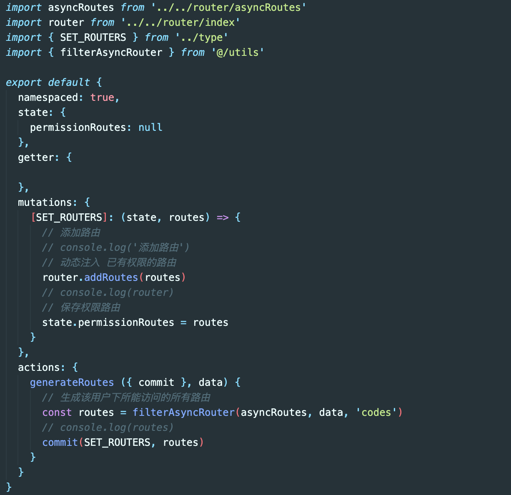

### 背景

&ensp;&ensp;&ensp;&ensp;&ensp;&ensp;&ensp;之前有做过这样一个后台管理的需求，要求不同身份的用户登录我们的后台管理系统会显示不同的功能菜单、路由页面、按钮等。其实就是要在前端做一个权限路由。

### 分析

&ensp;&ensp;&ensp;&ensp;&ensp;&ensp;&ensp;我们可以做一个动态路由，获取用户信息之后来渲染路由数据，查阅vue-router文档，发现 [router.addRoutes](https://router.vuejs.org/zh/api/#router-addroutes)这个API可以支持我们来实现一个动态的路由。接下来就是各种的逻辑通过用户的权限码来匹配不同的路由啦。

### 步骤
- 先和后端定义好每一个code码所对应的权限名称还有页面。（比如说，code：user_manage，代表 用户管理 这个菜单，所以用户管理菜单的权限码就是user_manage）

- 在前端先定义好一个权限码静态路由配置项，这个配置项里标识了每个code码对应的菜单名和页面组件等信息
  
  我们定义好的这个路由配置项的结构符合 routes 选项要求的数组，最后只要将这个数组作为 router.addRoutes 的参数传进去即可。

- 接下来，在用户登录的时候我们就获取这个用户下的所有权限code码数组。
  
  获取权限码之后我们要进行一些处理，通过这个权限码数组来生成对应的路由项
  

- 根据这个权限码数组以及我们定义好的权限码静态路由配置项，遍历生成该用户所能访问的路由数据。
  
  具体的代码处理逻辑可以看上图

- 最后就是调用 vue-router 的 addRoutes 动态创建真实路由

- 我们的菜单栏也是通过遍历这个路由来创建的